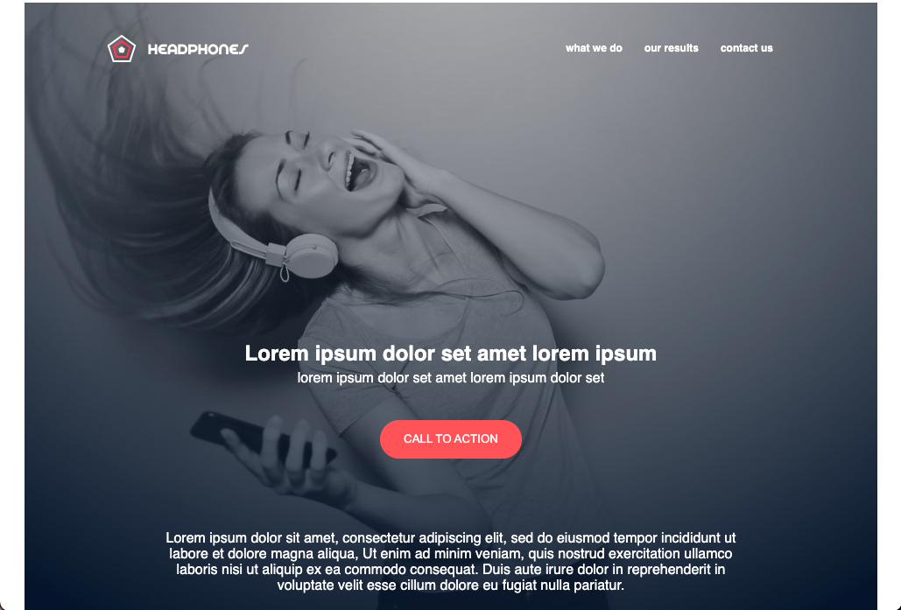

# atlas-headphones
## Project Objective
- The goal of this project was to implement a responsive and accessible design based on a given Figma page, to be accessible in 3 version (Desktop, Mobile, and Tablet).

## Project Description
- Atlas Headphones is a project inspired by a real-world design challenge, where we were tasked with turning a Figma desgin into a fully responsive, accessible web page.
- We implement a design from scratch using a given figma page. Once the design is implemented in both HTML and CSS, it'll have to be accessibile and responsive.
- My partner Raesean and I created 3 different model for this figma. Raesean worked on the Desktop version while I work on the tablet part of the css then we got together to work on the mobile part.

## About the Developers
I'm Rasheed Wbite, a full-stack developer focused on creating an accessible and responsive design. Connect with me on **[LinkedIn](https://www.linkedin.com/in/raeseanwhite/)**
My partner KEVIN and I collaborated on this project, bringing together our individual strengths to create this responsive webpage. 

## Implemented Features
- Responsive Design
- Accessibility
- CSS

## Features to be Implemented
- Interactive Elements

## Challenges Faced
- Consistency Across Devices: The challenge we faced was ensuring the visual design, layouts and styles match exactly to the figma page.

## Website page
https://kvang2.github.io/atlas-headphones/

## Authors
- **[Rasheed White](https://github.com/ReyesxRoyal)**

## Screenshot

